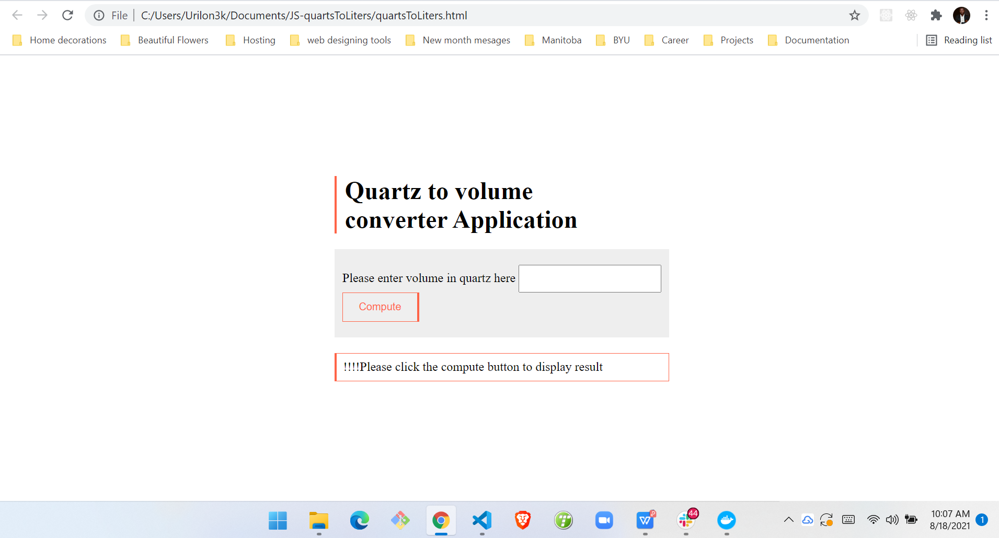

# JS-quartsToLiters
<p>
Simple JavaScript program that asks a user for a volume in quarts and then converts that value into liters. The program correctly handles real numbers such as 9.32.
</p>

## Defining Table

<br>

```javascript
// Input(s) : A volume in Quarts 
// Processing : Convert the volume from Quartz to Litres 
// Output(s) : The volume converted to Litres

// Heres the JS code. be sure to reference index HTML for the class and Id declarations

function Quartz_to_ltr_func() {
        var user_input = document.getElementById('value_in_quartz').value;
        var output_div = document.getElementById('computed');
        process_input= parseFloat(user_input);

        //1 quart (qt) = 0.946353 liter (l)
        var result = process_input * 0.946353;
        output_div.innerHTML = user_input + " Quartz is Equivalent to " + result + " Litres";

    }
```


## Screenshots

<br>




  

  
## Extras

Feel free to email me anytime with your questions, link in profile page, if you need help understanding the code. 

You may copy or use the code as it pleases you.

Enjoy

&copy; Israel Damilola Akinwumi
  
